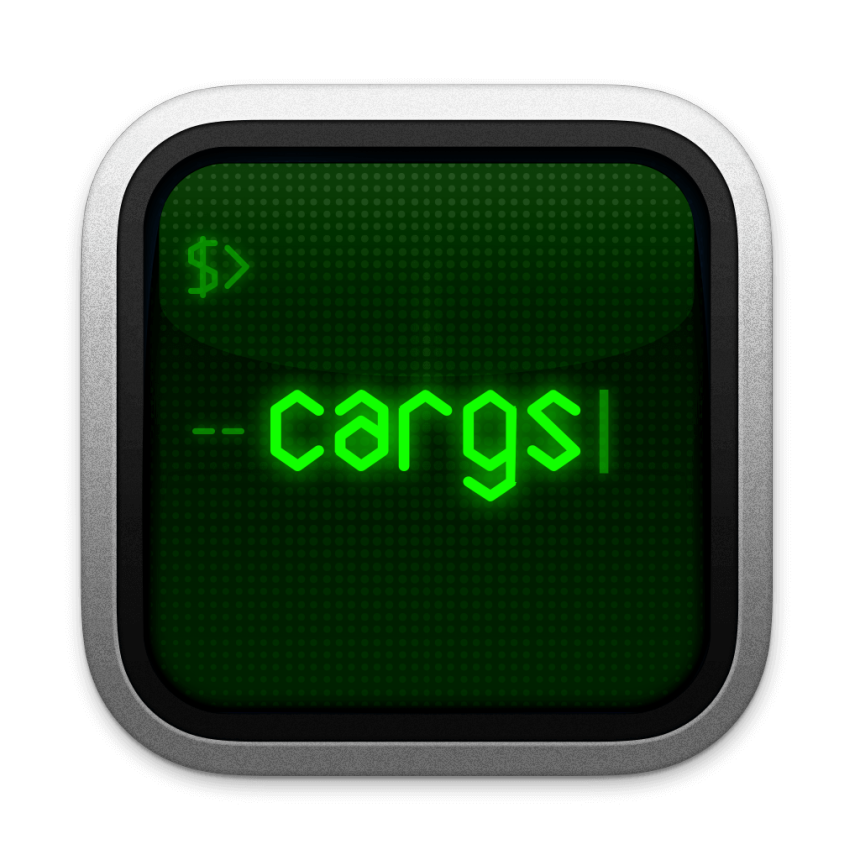

<p align="center">
  
</p>

# cargs


[](https://opensource.org/licenses/MIT)

> Modern C library for command-line argument parsing with an elegant, macro-based API.

**cargs** is a powerful C library for handling command-line arguments, designed to be both simple to use and flexible enough for advanced usage scenarios.

## ✨ Features

- 📋 **Help generation**: automatic formatted help and usage display
- 🔄 **Typed options**: booleans, integers, strings, floats, arrays, maps
- 🎨 **Flexible format parsing**: supports multiple option formats (--option=value, --option value, -ovalue, etc.)
- 🌳 **Subcommands**: Git/Docker-style nested command support
- ⚠️ **Clear error reporting**: detailed and user-friendly error messages for invalid options or values
- ✨ **Elegant design**: define options with concise, expressive macros
- 🔍 **Built-in validators**: built-in range, choices, regex patterns with comprehensive predefined sets
- 📦 **Organized option grouping**: visually group related options in help displays
- 🔗 **Option relationships**: define dependencies and conflicts between options
- 🚦 **Smart validation**: comprehensive option structure checking during development to prevent runtime errors, with a release mode for optimal performance in production
- 🌐 **Environment variables**: automatic ENV configuration
- 🚀 **Memory efficiency**: minimizes heap allocations for better performance and reliability
- 🧰 **Easy option customization**: create your own option types and handlers
- 🛡️ **Custom validation pipeline**: design your own validators with flexible pre/post processing

## 📦 Installation

### ⚙️ Dependencies

By default, cargs requires:
- **PCRE2**: Required for regex validation support
  - Ubuntu/Debian: `apt install libpcre2-dev`
  - Fedora/CentOS: `dnf install pcre2-devel`
  - macOS: `brew install pcre2`

To build without PCRE2 dependency (disabling regex support):
```bash
# Using Meson
meson setup -Ddisable_regex=true builddir

# Using Just
just disable_regex=true build

# Using install script
./install.sh --disable-regex
``

### 💻 From Source

#### 🛠️ Using Meson

```bash
# Clone the repo
git clone https://github.com/lucocozz/cargs.git
cd cargs

# Build
meson setup builddir
meson compile -C builddir

# Install (requires permissions)
meson install -C builddir
```

#### ⚡ Using Just (recommended for development)

```bash
# Clone the repo
git clone https://github.com/lucocozz/cargs.git
cd cargs

# Install Just if you don't have it
# https://github.com/casey/just

# Build both static and shared libraries
just build

# The libraries are now available:
# - libcargs.so (shared library)
# - libcargs.a (static library)

# Install
just install
```

### 📚 Using as a Static Library

If you prefer not to install the library system-wide, you can:

1. Build the project as shown above
2. Copy `libcargs.a` to your project
3. Copy the `includes/` directory to your project
4. Link against the static library:
   ```bash
   gcc your_program.c -o your_program -L/path/to/libcargs.a -lcargs
   ```

### 🧩 As a Dependency in a Meson Project

```meson
cargs_dep = dependency('cargs', fallback: ['cargs', 'cargs_dep'])
```

### Packaging

> **Note:** Official packages for various distributions are planned for future releases.


## Quick Example

```c
#include "cargs.h"
#include <stdio.h>

// Define options
CARGS_OPTIONS(
    options,
    HELP_OPTION(FLAGS(FLAG_EXIT)),
    VERSION_OPTION(FLAGS(FLAG_EXIT)),
    OPTION_FLAG('v', "verbose", HELP("Enable verbose output")),
    OPTION_STRING('o', "output", HELP("Output file"), DEFAULT("output.txt")),
    OPTION_INT('p', "port", HELP("Port number"), RANGE(1, 65535), DEFAULT(8080)),
    POSITIONAL_STRING("input", HELP("Input file"))
)

int main(int argc, char **argv)
{
    // Initialize cargs
    cargs_t cargs = cargs_init(options, "my_program", "1.0.0");
    cargs.description = "cargs demonstrator";

    // Parse arguments
    if (cargs_parse(&cargs, argc, argv) != CARGS_SUCCESS) {
        return 1;
    }

    // Access parsed values
    const char *input = cargs_get(cargs, "input").as_string;
    const char *output = cargs_get(cargs, "output").as_string;
    int port = cargs_get(cargs, "port").as_int;
    bool verbose = cargs_get(cargs, "verbose").as_bool;

    printf("Configuration:\n");
    printf("  Input: %s\n", input);
    printf("  Output: %s\n", output);
    printf("  Port: %d\n", port);
    printf("  Verbose: %s\n", verbose ? "yes" : "no");

    // Free resources
    cargs_free(&cargs);
    return 0;
}
```

## ⚖️ Comparison with Alternatives

cargs offers several advantages over existing command-line parsing libraries:

| Feature | cargs | getopt | argp | argtable3 |
|---------|-------|--------|------|-----------|
| Concise macro-based API | ✅ | ❌ | ❌ | ❌ |
| Type Safety | ✅ | ❌ | ❌ | ✅ |
| Nested Subcommands | ✅ | ❌ | ❌ | ❌ |
| Built-in Validation | ✅ | ❌ | ❌ | ✅ |
| Environment Variables | ✅ | ❌ | ❌ | ❌ |
| Maps & Arrays | ✅ | ❌ | ❌ | ❌ |
| Regex Support | ✅ | ❌ | ❌ | ❌ |
| Auto-generated Help | ✅ | ❌ | ✅ | ✅ |
| Dependencies | PCRE2 | libc | GNU | None |
| Learning Curve | Low | Medium | High | Medium |

While getopt provides a minimal POSIX-compliant interface and argp offers more functionality for GNU systems, cargs focuses on providing a modern, type-safe, and elegant approach to command-line parsing. Unlike other libraries that require verbose procedural code, cargs enables concise, maintainable option definitions with its macro-based system.

The key differentiator of cargs is its balance between ease of use and powerful features, making it suitable for both simple utilities and complex command-line applications.

## 🔥 Advanced Features

### Subcommands (Git-style)

```c
CARGS_OPTIONS(
    add_options,
    HELP_OPTION(FLAGS(FLAG_EXIT)),
    OPTION_FLAG('f', "force", HELP("Force add operation"))
)

CARGS_OPTIONS(
    options,
    HELP_OPTION(FLAGS(FLAG_EXIT)),
    VERSION_OPTION(FLAGS(FLAG_EXIT)),
    SUBCOMMAND("add", add_options, HELP("Add a file"))
)
```

### Regex Validation

```c
CARGS_OPTIONS(
    options,
    HELP_OPTION(FLAGS(FLAG_EXIT)),
    OPTION_STRING('e', "email", HELP("Email address"), 
                REGEX(CARGS_RE_EMAIL))
)
```

### Multi-value Collections

```c
CARGS_OPTIONS(
    options,
    HELP_OPTION(FLAGS(FLAG_EXIT)),
    OPTION_ARRAY_INT('n', "numbers", HELP("List of numbers"), 
                    FLAGS(FLAG_SORTED | FLAG_UNIQUE)),
    OPTION_MAP_STRING('e', "env", HELP("Environment variables"))
)

// Usage: --numbers=1,2,3 --env=KEY1=value1,KEY2=value2
```

## 📚 Documentation

For complete documentation, please visit [the online documentation](https://cargs.readthedocs.io/).

Check the `examples/` directory for more practical examples.

## 🤖 Cargs guide for LLMs

[download](docs/assets/llm-references.md)

## 🗺️ Roadmap

Future planned features:

- 📄 **Configuration files support**: Parse options from JSON, YAML, or other config file formats
- 🪶 **Lightweight version**: Reduced footprint version for constrained systems 
- 🎨 **Themed help output**: Customizable colored help display with theme support
- ✅ **Advanced validators**:
  - Date/time format validation
  - File existence and type checking
  - String length and array size constraints
  - Semantic versioning validation
  - Contextual validation (based on other option values)
- 📦 **Packaging**: Official packages for various distributions
- Shell completion scripts generation
- Alias support for options

## 👥 Contributing

Contributions are welcome! See [CONTRIBUTING.md](CONTRIBUTING.md) for details.

## 📜 License

This project is licensed under the MIT License - see the [LICENSE](LICENSE) file for details.

---

<p align="center">
  <i>Built with ❤️ by <a href="https://github.com/lucocozz">lucocozz</a></i>
</p>
