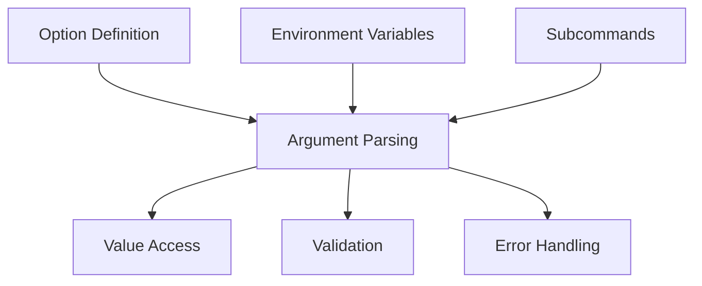
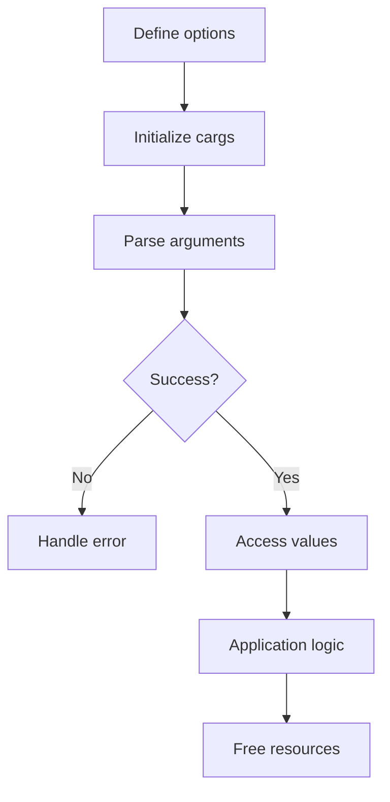

# API Overview

!!! abstract "Overview"
    This page provides a comprehensive overview of the cargs API architecture and its key components. cargs is designed to be both simple for basic usage and powerful enough for complex command-line interfaces.

## Architecture

cargs is organized around several key components:



1. **Option Definition** - Macros for defining options and their properties
2. **Argument Parsing** - Functions for processing command-line arguments
3. **Value Access** - Functions for retrieving parsed values
4. **Validation** - Mechanisms for validating inputs
5. **Error Handling** - System for managing and reporting errors
6. **Environment Variables** - Support for configuring via environment
7. **Subcommands** - Support for command hierarchies

## Key Components

### Main Structure

The `cargs_t` structure is the core of cargs, containing all necessary data:

```c
typedef struct cargs_s {
    /* Public fields */
    const char *program_name;    // Program name
    const char *version;         // Program version
    const char *description;     // Program description
    const char *env_prefix;      // Prefix for environment variables
    
    /* Internal fields - do not access directly */
    cargs_option_t     *options;      // Defined options
    cargs_error_stack_t error_stack;  // Error stack
    // Other internal fields...
} cargs_t;
```

!!! warning "Internal Fields"
    Only access the public fields directly. The internal fields should be accessed through the provided API functions.

### Option Definition

Options are defined using the `CARGS_OPTIONS` macro along with option-specific macros:

```c
CARGS_OPTIONS(
    options,
    HELP_OPTION(FLAGS(FLAG_EXIT)),
    OPTION_STRING('o', "output", "Output file", DEFAULT("output.txt")),
    OPTION_INT('p', "port", "Port number", RANGE(1, 65535), DEFAULT(8080)),
    OPTION_FLAG('v', "verbose", "Enable verbose output"),
    POSITIONAL_STRING("input", "Input file")
)
```

The `cargs_option_t` structure represents an individual option with all its properties.

### Value Types

cargs supports various value types for options:

| Category | Types | Description |
|----------|-------|-------------|
| **Primitive** | `VALUE_TYPE_STRING`<br>`VALUE_TYPE_INT`<br>`VALUE_TYPE_FLOAT`<br>`VALUE_TYPE_BOOL` | Basic value types |
| **Array** | `VALUE_TYPE_ARRAY_STRING`<br>`VALUE_TYPE_ARRAY_INT`<br>`VALUE_TYPE_ARRAY_FLOAT` | Arrays of multiple values |
| **Map** | `VALUE_TYPE_MAP_STRING`<br>`VALUE_TYPE_MAP_INT`<br>`VALUE_TYPE_MAP_FLOAT`<br>`VALUE_TYPE_MAP_BOOL` | Key-value pairs |
| **Custom** | `VALUE_TYPE_CUSTOM` | User-defined types |

Values are stored in a `value_t` union that can contain different types:

```c
union value_u {
    uintptr_t raw;
    void     *as_ptr;
    
    char     *as_string;
    int       as_int;
    double    as_float;
    bool      as_bool;
    
    // Collection types
    value_t      *as_array;
    cargs_pair_t *as_map;
    // ...
};
```

### Option Types

Options are categorized into several types:

| Type | Macro | Description | Example |
|------|-------|-------------|---------|
| **Regular options** | `OPTION_*` | Standard options with - or -- prefix | `OPTION_INT('p', "port", "Port number")` |
| **Flag options** | `OPTION_FLAG` | Boolean options | `OPTION_FLAG('v', "verbose", "Enable verbose mode")` |
| **Positional arguments** | `POSITIONAL_*` | Arguments without dash prefix | `POSITIONAL_STRING("input", "Input file")` |
| **Subcommands** | `SUBCOMMAND` | Command hierarchies | `SUBCOMMAND("add", add_options, ...)` |
| **Option groups** | `GROUP_START` ... `GROUP_END` | Visual grouping | `GROUP_START("Network", ...)` |
| **Collection options** | `OPTION_ARRAY_*`<br>`OPTION_MAP_*` | Multiple values | `OPTION_ARRAY_STRING('t', "tags", "Tags")` |

## API Lifecycle

Typical cargs usage follows this lifecycle:



1. **Define options** with `CARGS_OPTIONS`
2. **Initialize** with `cargs_init()`
3. **Parse arguments** with `cargs_parse()`
4. **Access values** with `cargs_get()`, `cargs_is_set()`, etc.
5. **Free resources** with `cargs_free()`

```c
// 1. Define options
CARGS_OPTIONS(options, /* ... */)

int main(int argc, char **argv)
{
    // 2. Initialize
    cargs_t cargs = cargs_init(options, "my_program", "1.0.0");
    cargs.description = "My program description";
    
    // 3. Parse arguments
    int status = cargs_parse(&cargs, argc, argv);
    if (status != CARGS_SUCCESS) {
        return status;
    }
    
    // 4. Access values
    const char *output = cargs_get(cargs, "output").as_string;
    bool verbose = cargs_get(cargs, "verbose").as_bool;
    
    // Application logic...
    
    // 5. Free resources
    cargs_free(&cargs);
    return 0;
}
```

## Function Families

The cargs API is organized into several function families:

### Initialization and Parsing Functions

| Function | Description | Example |
|----------|-------------|---------|
| `cargs_init()` | Initializes the cargs context | `cargs_t cargs = cargs_init(options, "my_program", "1.0.0");` |
| `cargs_parse()` | Parses command-line arguments | `int status = cargs_parse(&cargs, argc, argv);` |
| `cargs_free()` | Frees resources | `cargs_free(&cargs);` |

### Value Access Functions

| Function | Description | Example |
|----------|-------------|---------|
| `cargs_get()` | Retrieves an option's value | `int port = cargs_get(cargs, "port").as_int;` |
| `cargs_is_set()` | Checks if an option was set | `if (cargs_is_set(cargs, "verbose")) { ... }` |
| `cargs_count()` | Gets the number of values for an option | `size_t count = cargs_count(cargs, "names");` |
| `cargs_array_get()` | Retrieves an element from an array | `const char* name = cargs_array_get(cargs, "names", 0).as_string;` |
| `cargs_map_get()` | Retrieves a value from a map | `int port = cargs_map_get(cargs, "ports", "http").as_int;` |

### Iteration Functions

| Function | Description | Example |
|----------|-------------|---------|
| `cargs_array_it()` | Creates an array iterator | `cargs_array_it_t it = cargs_array_it(cargs, "names");` |
| `cargs_array_next()` | Advances to the next array element | `while (cargs_array_next(&it)) { ... }` |
| `cargs_array_reset()` | Resets an array iterator | `cargs_array_reset(&it);` |
| `cargs_map_it()` | Creates a map iterator | `cargs_map_it_t it = cargs_map_it(cargs, "env");` |
| `cargs_map_next()` | Advances to the next map entry | `while (cargs_map_next(&it)) { ... }` |
| `cargs_map_reset()` | Resets a map iterator | `cargs_map_reset(&it);` |

### Subcommand Functions

| Function | Description | Example |
|----------|-------------|---------|
| `cargs_has_command()` | Checks if a subcommand was specified | `if (cargs_has_command(cargs)) { ... }` |
| `cargs_exec()` | Executes the action associated with a subcommand | `status = cargs_exec(&cargs, data);` |

### Display Functions

| Function | Description | Example |
|----------|-------------|---------|
| `cargs_print_help()` | Displays a formatted help message | `cargs_print_help(cargs);` |
| `cargs_print_usage()` | Displays a short usage message | `cargs_print_usage(cargs);` |
| `cargs_print_version()` | Displays version information | `cargs_print_version(cargs);` |

## Error Handling

cargs uses an error code system and an error stack for comprehensive error handling:

```c
// Parse arguments with error handling
int status = cargs_parse(&cargs, argc, argv);
if (status != CARGS_SUCCESS) {
    // An error occurred during parsing
    cargs_print_error_stack(&cargs);  // Display detailed errors
    return status;
}
```

Common error codes:

| Error Code | Description |
|------------|-------------|
| `CARGS_SUCCESS` | Operation successful |
| `CARGS_ERROR_INVALID_ARGUMENT` | Invalid argument |
| `CARGS_ERROR_MISSING_VALUE` | Value required but not provided |
| `CARGS_ERROR_MISSING_REQUIRED` | Required option not provided |
| `CARGS_ERROR_INVALID_FORMAT` | Value format is incorrect |
| `CARGS_ERROR_INVALID_RANGE` | Value outside allowed range |
| `CARGS_ERROR_INVALID_CHOICE` | Value not in allowed choices |
| `CARGS_ERROR_CONFLICTING_OPTIONS` | Mutually exclusive options specified |

## Advanced Components

### Validators

Validators check that input values meet certain criteria:

=== "Range Validator"
    ```c
    // Ensure port is between 1 and 65535
    OPTION_INT('p', "port", "Port number", RANGE(1, 65535))
    ```

=== "Regular Expression Validator"
    ```c
    // Ensure email is valid
    OPTION_STRING('e', "email", "Email address", REGEX(CARGS_RE_EMAIL))
    ```

=== "Custom Validator"
    ```c
    // Custom validation logic
    OPTION_INT('n', "number", "Even number", 
               VALIDATOR(even_validator, NULL))
    ```

### Handlers

Handlers process input values and convert them to internal representations:

```c
// Custom handler for IPv4 addresses
int ipv4_handler(cargs_t *cargs, cargs_option_t *option, char *arg);

// Usage
OPTION_BASE('i', "ip", "IP address", VALUE_TYPE_CUSTOM,
            HANDLER(ipv4_handler),
            FREE_HANDLER(ipv4_free_handler))
```

### Environment Variables

Options can be configured to read from environment variables:

```c
// Define options with environment variable support
CARGS_OPTIONS(
    options,
    OPTION_STRING('H', "host", "Hostname", 
                  ENV_VAR("HOST")),  // Will use APP_HOST
    OPTION_INT('p', "port", "Port number", 
               FLAGS(FLAG_AUTO_ENV))  // Will use APP_PORT
)

// Set the environment prefix
cargs_t cargs = cargs_init(options, "my_program", "1.0.0");
cargs.env_prefix = "APP";
```

## Header Organization

The cargs public API is distributed across several header files:

| Header | Content | Include When You Need |
|--------|---------|----------------------|
| `cargs.h` | Main entry point, includes all other headers | Always |
| `cargs/types.h` | Type and data structure definitions | Rarely needed directly |
| `cargs/options.h` | Macros for defining options | Rarely needed directly |
| `cargs/api.h` | Public API functions | Rarely needed directly |
| `cargs/errors.h` | Error codes and error handling functions | When handling specific errors |
| `cargs/regex.h` | Predefined regular expression patterns | When using regex validation |

In most cases, you'll only need to include the main header:

```c
#include "cargs.h"
```

## Example Code

Here's a complete example demonstrating key features of cargs:

```c
#include "cargs.h"
#include <stdio.h>
#include <stdlib.h>

// Define options
CARGS_OPTIONS(
    options,
    HELP_OPTION(FLAGS(FLAG_EXIT)),
    VERSION_OPTION(FLAGS(FLAG_EXIT)),
    
    // Regular options
    OPTION_FLAG('v', "verbose", "Enable verbose output"),
    OPTION_STRING('o', "output", "Output file", DEFAULT("output.txt")),
    OPTION_INT('p', "port", "Port number", RANGE(1, 65535), DEFAULT(8080)),
    
    // Option group
    GROUP_START("Advanced", GROUP_DESC("Advanced options")),
        OPTION_FLAG('f', "force", "Force operation"),
        OPTION_FLAG('r', "recursive", "Recursive mode"),
    GROUP_END(),
    
    // Array options
    OPTION_ARRAY_STRING('t', "tag", "Tags", FLAGS(FLAG_SORTED | FLAG_UNIQUE)),
    
    // Positional arguments
    POSITIONAL_STRING("input", "Input file")
)

int main(int argc, char **argv)
{
    // Initialize cargs
    cargs_t cargs = cargs_init(options, "example", "1.0.0");
    cargs.description = "Example program demonstrating cargs";
    
    // Parse arguments
    int status = cargs_parse(&cargs, argc, argv);
    if (status != CARGS_SUCCESS) {
        return status;
    }
    
    // Access values
    const char *input = cargs_get(cargs, "input").as_string;
    const char *output = cargs_get(cargs, "output").as_string;
    int port = cargs_get(cargs, "port").as_int;
    bool verbose = cargs_get(cargs, "verbose").as_bool;
    bool force = cargs_get(cargs, "force").as_bool;
    bool recursive = cargs_get(cargs, "recursive").as_bool;
    
    // Process array values if set
    if (cargs_is_set(cargs, "tag")) {
        size_t count = cargs_count(cargs, "tag");
        printf("Tags (%zu):\n", count);
        
        cargs_array_it_t it = cargs_array_it(cargs, "tag");
        while (cargs_array_next(&it)) {
            printf("  - %s\n", it.value.as_string);
        }
    }
    
    // Application logic...
    
    // Free resources
    cargs_free(&cargs);
    return 0;
}
```

## Related Documentation

For more detailed information on specific aspects of the API:

- [Types Reference](types.md) - Detailed information about data types
- [Macros Reference](macros.md) - Complete list of option definition macros
- [Functions Reference](functions.md) - Comprehensive API function reference
- [Regex Patterns](regex_patterns.md) - Predefined regular expression patterns
