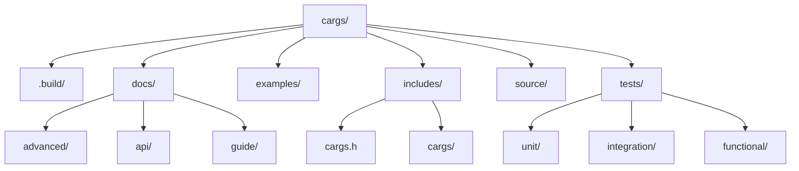

# Contributing to cargs

!!! abstract "Overview"
    Thank you for your interest in contributing to cargs! This guide explains how to set up your development environment, submit contributions, and interact with the community. We welcome contributions from everyone, regardless of experience level.

## Table of Contents

- [Code of Conduct](#code-of-conduct)
- [Getting Started](#getting-started)
- [Contribution Workflow](#contribution-workflow)
- [Coding Guidelines](#coding-guidelines)
- [Project Structure](#project-structure)
- [Common Tasks](#common-tasks)
- [Getting Help](#getting-help)

## Code of Conduct

!!! note "Be Respectful"
    Please be respectful and considerate of others when participating in this project. We expect everyone to adhere to professional standards of communication and collaboration. Harassment, offensive comments, and other unprofessional conduct will not be tolerated.

## Getting Started

### Development Environment Setup

!!! tip "Prerequisites"
    To contribute to cargs effectively, you'll need the following tools installed:
    
    - C compiler (GCC or Clang)
    - Meson build system (≥ 1.0.0)
    - Ninja build tool
    - PCRE2 library (for regex support)
    - Criterion (for testing)
    - Just (for convenient scripting) - recommended
    - clang-format and clang-tidy (for code formatting and static analysis)

=== "Ubuntu/Debian"
    ```bash
    sudo apt-get update
    sudo apt-get install -y \
      gcc \
      meson \
      ninja-build \
      libpcre2-dev \
      libcriterion-dev \
      clang-format \
      clang-tidy
    
    # Install Just (optional)
    # See https://github.com/casey/just#installation
    ```

=== "Fedora/CentOS"
    ```bash
    sudo dnf install -y \
      gcc \
      meson \
      ninja-build \
      pcre2-devel \
      criterion-devel \
      clang-tools-extra
    
    # Install Just (optional)
    # See https://github.com/casey/just#installation
    ```

=== "macOS"
    ```bash
    brew install \
      gcc \
      meson \
      ninja \
      pcre2 \
      criterion \
      clang-format \
      just
    ```

### GitHub Workflow for Open-Source Contributions

!!! abstract "The Fork & Pull Request Model"
    This project follows the standard GitHub fork and pull request workflow. If you're new to this process, here's how it works:

=== "Step 1: Fork the Repository"
    Navigate to the [original repository](https://github.com/lucocozz/cargs) and click the "Fork" button in the top-right corner. This creates a copy of the repository in your GitHub account.
    
    

=== "Step 2: Clone Your Fork"
    ```bash
    # Clone YOUR fork to your local machine (replace YOUR_USERNAME with your GitHub username)
    git clone https://github.com/YOUR_USERNAME/cargs.git
    cd cargs
    
    # Add the original repository as a remote called "upstream"
    git remote add upstream https://github.com/lucocozz/cargs.git
    ```

=== "Step 3: Keep Your Fork Updated"
    ```bash
    # Fetch changes from the original repository
    git fetch upstream
    
    # Merge changes from upstream/develop into your local develop branch
    git checkout develop
    git merge upstream/develop
    
    # Push the updates to your fork
    git push origin develop
    ```

### Building the Project

After cloning your fork, you can build the project:

=== "Using Meson"
    ```bash
    # Build
    meson setup .build
    meson compile -C .build
    ```

=== "Using Just (recommended)"
    ```bash
    # Build static and shared libraries
    just build
    ```

### Running Tests

!!! warning "Important"
    Always run tests before submitting a pull request to ensure your changes don't break existing functionality.

```bash
# Run all tests
just test

# Run only unit tests
just test-unit

# Run only integration tests
just test-integration

# Run only functional tests
just test-functional

# Run a specific test
just test-one unit_strings
```

## Contribution Workflow

!!! abstract "Process Overview"
    We use the "Issue First" approach to manage contributions:
    
    1. **Create an Issue First**: Before submitting a Pull Request, create an issue to discuss the change you'd like to make
    2. **Wait for Feedback**: Allow the community and maintainers to provide input
    3. **Implement Changes**: Once there's agreement on how to proceed
    4. **Submit a Pull Request**: Reference the issue in your PR

### Creating Issues

Before writing any code, create an issue to discuss your proposed changes:

- For bugs, create a **Bug Report** using the template
- For new features, create a **Feature Request** using the template
- For questions, use the **Question** template or GitHub Discussions

Provide as much detail as possible to help maintainers understand your proposal or the bug you've encountered.

### Making Changes

After setting up your fork, follow these steps to make changes to the codebase:

1. **Ensure your fork is up to date** with the original repository:

    ```bash
    git fetch upstream
    git checkout develop
    git merge upstream/develop
    ```

2. **Create a branch** with a descriptive name:

    ```bash
    git checkout -b feature/my-new-feature  # or bugfix/issue-description
    ```

    !!! tip "Branch Naming Conventions"
        - `feature/` - for new features
        - `bugfix/` - for bug fixes
        - `docs/` - for documentation changes
        - `refactor/` - for code refactoring
        - `test/` - for adding or updating tests

3. **Make focused changes** that address only the issue at hand

4. **Add tests** for your changes, especially for bug fixes and new features

5. **Ensure code quality** with formatting and linting:

    ```bash
    # Format your code
    just format
    
    # Run static analysis
    just lint
    ```

6. **Commit your changes** with clear, descriptive commit messages:

    ```bash
    git add .
    git commit -m "feat: add support for xyz"  # or "fix: resolve issue with abc"
    ```

    Follow [Conventional Commits](https://www.conventionalcommits.org/) format when possible:
    
    | Type | Description |
    |------|-------------|
    | `feat` | New feature |
    | `fix` | Bug fix |
    | `docs` | Documentation change |
    | `style` | Formatting, etc; no code change |
    | `refactor` | Refactoring code |
    | `test` | Adding or updating tests |
    | `chore` | Updating build tasks, etc; no code change |

### Submitting Pull Requests

=== "Step 1: Push Changes"
    ```bash
    # Push your branch to your fork
    git push origin feature/my-new-feature
    ```

=== "Step 2: Create PR"
    Go to the [original repository](https://github.com/lucocozz/cargs) on GitHub. You should see a "Compare & pull request" button for your recently pushed branch.
    
    
    
    Click this button and fill out the PR template completely.

=== "Step 3: Reference Issue"
    Make sure to reference the original issue in your PR description using "Fixes #123" or "Closes #123" syntax. This automatically links the PR to the issue and will close the issue when the PR is merged.
    
    Example: `This PR fixes #42 by implementing the new feature.`

!!! tip "PR Guidelines"
    1. **One PR per issue**: Keep your changes focused on addressing a single issue
    2. **Follow coding style**: Ensure your code is formatted according to the project standards
    3. **Write tests**: Add tests to cover your changes
    4. **Update documentation**: Keep documentation in sync with your changes
    5. **Keep PRs small**: Smaller, focused PRs are easier to review and more likely to be accepted

## Coding Guidelines

### Code Style

cargs follows a consistent coding style enforced by clang-format:

| Rule | Value |
|------|-------|
| Indentation | 4 spaces (no tabs) |
| Line length | 100 characters maximum |
| Function braces | On new line |
| Operators | Spaced (e.g., `a + b`) |
| Naming | Descriptive, lowercase with underscores |

!!! note "Automatic Formatting"
    The style is defined in the `.clang-format` file. Always run `just format` before committing changes to ensure your code follows the project style.

### Documentation

Good documentation is crucial for maintaining the codebase:

- Document all public functions, types, and macros
- Write clear comments for complex logic
- Update documentation when changing functionality
- Use markdown for documentation files

```c
/**
 * Parses command-line arguments according to the defined options.
 *
 * @param cargs Pointer to an initialized cargs context
 * @param argc  Argument count (from main)
 * @param argv  Argument values (from main)
 * @return CARGS_SUCCESS on success, error code otherwise
 */
int cargs_parse(cargs_t *cargs, int argc, char **argv);
```

### Testing

!!! warning "Tests are Required"
    All new features and bug fixes should include tests to verify their correctness.

- Write tests for all new features
- Update tests when modifying existing functionality
- Ensure all tests pass before submitting a PR
- Aim for high test coverage (especially for core functionality)

## Project Structure

Understanding the project structure will help you make contributions more effectively:



| Directory | Description |
|-----------|-------------|
| `.build/` | Build directory (created by Meson) |
| `docs/` | Documentation files |
| `examples/` | Example programs |
| `includes/` | Public header files |
| `source/` | Source code implementation |
| `tests/` | Test suites |

## Common Tasks

The Justfile provides shortcuts for common development tasks:

=== "Building"
    ```bash
    # Build the project
    just build
    
    # Clean build artifacts
    just clean
    
    # Full clean (remove build directory)
    just fclean
    
    # Rebuild from scratch
    just re
    ```

=== "Code Quality"
    ```bash
    # Format code
    just format
    
    # Static analysis
    just lint
    
    # Apply automated fixes
    just fix
    ```

=== "Testing"
    ```bash
    # Run all tests
    just test
    
    # Run a specific test suite
    just test-unit
    just test-integration
    just test-functional
    
    # Run a specific test
    just test-one unit_strings
    
    # Generate test coverage report
    just test-coverage
    ```

=== "Installation"
    ```bash
    # Install the library
    just install
    
    # Uninstall the library
    just uninstall
    ```

!!! tip "Listing Available Commands"
    ```bash
    # Show all available commands
    just help
    ```

## Getting Help

If you have questions or need help with contributing:

- Open a discussion on GitHub Discussions
- Ask in the relevant issue
- Contact the maintainers directly

Thank you for contributing to cargs! 🎉
