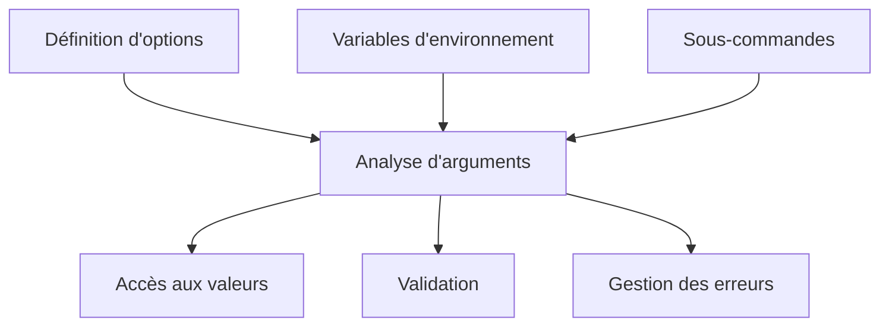
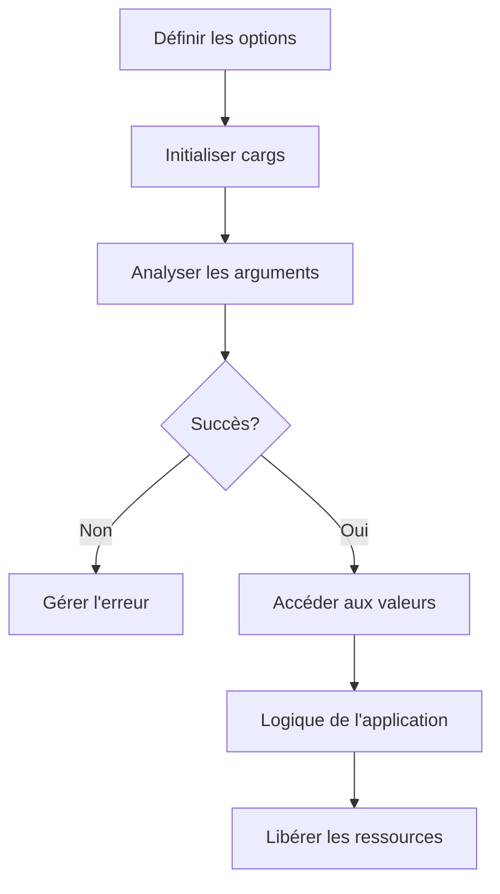

# Aperçu de l'API

!!! abstract "Aperçu"
    Cette page fournit une vue d'ensemble complète de l'architecture de l'API cargs et de ses composants clés. cargs est conçu pour être à la fois simple pour une utilisation basique et suffisamment puissant pour des interfaces en ligne de commande complexes.

## Architecture

cargs est organisé autour de plusieurs composants clés :



1. **Définition d'options** - Macros pour définir les options et leurs propriétés
2. **Analyse d'arguments** - Fonctions pour traiter les arguments de ligne de commande
3. **Accès aux valeurs** - Fonctions pour récupérer les valeurs analysées
4. **Validation** - Mécanismes pour valider les entrées
5. **Gestion des erreurs** - Système pour gérer et signaler les erreurs
6. **Variables d'environnement** - Support pour la configuration via l'environnement
7. **Sous-commandes** - Support pour les hiérarchies de commandes

## Composants clés

### Structure principale

La structure `cargs_t` est le cœur de cargs, contenant toutes les données nécessaires :

```c
typedef struct cargs_s {
    /* Champs publics */
    const char *program_name;    // Nom du programme
    const char *version;         // Version du programme
    const char *description;     // Description du programme
    const char *env_prefix;      // Préfixe pour les variables d'environnement
    
    /* Champs internes - ne pas accéder directement */
    cargs_option_t     *options;      // Options définies
    cargs_error_stack_t error_stack;  // Pile d'erreurs
    // Autres champs internes...
} cargs_t;
```

!!! warning "Champs internes"
    Accédez uniquement aux champs publics directement. Les champs internes doivent être accédés via les fonctions API fournies.

### Définition d'options

Les options sont définies en utilisant la macro `CARGS_OPTIONS` avec des macros spécifiques à chaque option :

```c
CARGS_OPTIONS(
    options,
    HELP_OPTION(FLAGS(FLAG_EXIT)),
    OPTION_STRING('o', "output", "Fichier de sortie", DEFAULT("output.txt")),
    OPTION_INT('p', "port", "Numéro de port", RANGE(1, 65535), DEFAULT(8080)),
    OPTION_FLAG('v', "verbose", "Activer le mode verbeux"),
    POSITIONAL_STRING("input", "Fichier d'entrée")
)
```

La structure `cargs_option_t` représente une option individuelle avec toutes ses propriétés et son comportement.

### Types de valeurs

cargs prend en charge divers types de valeurs pour les options :

| Catégorie | Types | Description |
|----------|-------|-------------|
| **Primitifs** | `VALUE_TYPE_STRING`<br>`VALUE_TYPE_INT`<br>`VALUE_TYPE_FLOAT`<br>`VALUE_TYPE_BOOL` | Types de valeurs de base |
| **Tableaux** | `VALUE_TYPE_ARRAY_STRING`<br>`VALUE_TYPE_ARRAY_INT`<br>`VALUE_TYPE_ARRAY_FLOAT` | Tableaux de valeurs multiples |
| **Maps** | `VALUE_TYPE_MAP_STRING`<br>`VALUE_TYPE_MAP_INT`<br>`VALUE_TYPE_MAP_FLOAT`<br>`VALUE_TYPE_MAP_BOOL` | Paires clé-valeur |
| **Personnalisés** | `VALUE_TYPE_CUSTOM` | Types définis par l'utilisateur |

Les valeurs sont stockées dans une union `value_t` qui peut contenir différents types :

```c
union value_u {
    uintptr_t raw;          // Valeur brute sous forme d'entier
    void     *as_ptr;       // Pointeur générique
    
    // Types de base
    char     *as_string;    // Chaîne de caractères
    int       as_int;       // Entier
    double    as_float;     // Flottant
    bool      as_bool;      // Booléen
    
    // Types de collection
    value_t      *as_array;  // Tableau de valeurs
    cargs_pair_t *as_map;    // Map de paires clé-valeur
};
```

### Types d'options

Les options sont catégorisées en plusieurs types :

| Type | Macro | Description | Exemple |
|------|-------|-------------|---------|
| **Options régulières** | `OPTION_*` | Options standard avec préfixe - ou -- | `OPTION_INT('p', "port", "Numéro de port")` |
| **Options drapeaux** | `OPTION_FLAG` | Options booléennes | `OPTION_FLAG('v', "verbose", "Mode verbeux")` |
| **Arguments positionnels** | `POSITIONAL_*` | Arguments sans préfixe tiret | `POSITIONAL_STRING("input", "Fichier d'entrée")` |
| **Sous-commandes** | `SUBCOMMAND` | Hiérarchies de commandes | `SUBCOMMAND("add", add_options, ...)` |
| **Groupes d'options** | `GROUP_START` ... `GROUP_END` | Regroupement visuel | `GROUP_START("Network", ...)` |
| **Options de collection** | `OPTION_ARRAY_*`<br>`OPTION_MAP_*` | Valeurs multiples | `OPTION_ARRAY_STRING('t', "tags", "Tags")` |

## Cycle de vie de l'API

L'utilisation typique de cargs suit ce cycle de vie :



1. **Définir les options** avec `CARGS_OPTIONS`
2. **Initialiser** avec `cargs_init()`
3. **Analyser les arguments** avec `cargs_parse()`
4. **Accéder aux valeurs** avec `cargs_get()`, `cargs_is_set()`, etc.
5. **Libérer les ressources** avec `cargs_free()`

```c
// 1. Définir les options
CARGS_OPTIONS(options, /* ... */)

int main(int argc, char **argv)
{
    // 2. Initialiser
    cargs_t cargs = cargs_init(options, "my_program", "1.0.0");
    cargs.description = "Description de mon programme";
    
    // 3. Analyser les arguments
    int status = cargs_parse(&cargs, argc, argv);
    if (status != CARGS_SUCCESS) {
        return status;
    }
    
    // 4. Accéder aux valeurs
    const char *output = cargs_get(cargs, "output").as_string;
    bool verbose = cargs_get(cargs, "verbose").as_bool;
    
    // Logique de l'application...
    
    // 5. Libérer les ressources
    cargs_free(&cargs);
    return 0;
}
```

## Familles de fonctions

L'API cargs est organisée en plusieurs familles de fonctions :

### Fonctions d'initialisation et d'analyse

| Fonction | Description | Exemple |
|----------|-------------|---------|
| `cargs_init()` | Initialise le contexte cargs | `cargs_t cargs = cargs_init(options, "my_program", "1.0.0");` |
| `cargs_parse()` | Analyse les arguments de ligne de commande | `int status = cargs_parse(&cargs, argc, argv);` |
| `cargs_free()` | Libère les ressources | `cargs_free(&cargs);` |

### Fonctions d'accès aux valeurs

| Fonction | Description | Exemple |
|----------|-------------|---------|
| `cargs_get()` | Récupère la valeur d'une option | `int port = cargs_get(cargs, "port").as_int;` |
| `cargs_is_set()` | Vérifie si une option a été définie | `if (cargs_is_set(cargs, "verbose")) { ... }` |
| `cargs_count()` | Obtient le nombre de valeurs pour une option | `size_t count = cargs_count(cargs, "names");` |
| `cargs_array_get()` | Récupère un élément d'un tableau | `const char* name = cargs_array_get(cargs, "names", 0).as_string;` |
| `cargs_map_get()` | Récupère une valeur d'une map | `int port = cargs_map_get(cargs, "ports", "http").as_int;` |

### Fonctions d'itération

| Fonction | Description | Exemple |
|----------|-------------|---------|
| `cargs_array_it()` | Crée un itérateur de tableau | `cargs_array_it_t it = cargs_array_it(cargs, "names");` |
| `cargs_array_next()` | Avance au prochain élément du tableau | `while (cargs_array_next(&it)) { ... }` |
| `cargs_array_reset()` | Réinitialise un itérateur de tableau | `cargs_array_reset(&it);` |
| `cargs_map_it()` | Crée un itérateur de map | `cargs_map_it_t it = cargs_map_it(cargs, "env");` |
| `cargs_map_next()` | Avance à la prochaine entrée de map | `while (cargs_map_next(&it)) { ... }` |
| `cargs_map_reset()` | Réinitialise un itérateur de map | `cargs_map_reset(&it);` |

### Fonctions de sous-commandes

| Fonction | Description | Exemple |
|----------|-------------|---------|
| `cargs_has_command()` | Vérifie si une sous-commande a été spécifiée | `if (cargs_has_command(cargs)) { ... }` |
| `cargs_exec()` | Exécute l'action associée à une sous-commande | `status = cargs_exec(&cargs, data);` |

### Fonctions d'affichage

| Fonction | Description | Exemple |
|----------|-------------|---------|
| `cargs_print_help()` | Affiche un message d'aide formaté | `cargs_print_help(cargs);` |
| `cargs_print_usage()` | Affiche un résumé d'utilisation | `cargs_print_usage(cargs);` |
| `cargs_print_version()` | Affiche les informations de version | `cargs_print_version(cargs);` |

## Gestion des erreurs

cargs utilise un système de codes d'erreur et une pile d'erreurs pour une gestion complète des erreurs :

```c
// Analyser les arguments avec gestion des erreurs
int status = cargs_parse(&cargs, argc, argv);
if (status != CARGS_SUCCESS) {
    // Une erreur s'est produite pendant l'analyse
    cargs_print_error_stack(&cargs);  // Afficher les erreurs détaillées
    return status;
}
```

Codes d'erreur courants :

| Code d'erreur | Description |
|------------|-------------|
| `CARGS_SUCCESS` | Opération réussie |
| `CARGS_ERROR_INVALID_ARGUMENT` | Argument invalide |
| `CARGS_ERROR_MISSING_VALUE` | Valeur requise mais non fournie |
| `CARGS_ERROR_MISSING_REQUIRED` | Option requise non fournie |
| `CARGS_ERROR_INVALID_FORMAT` | Format de valeur incorrect |
| `CARGS_ERROR_INVALID_RANGE` | Valeur hors de la plage autorisée |
| `CARGS_ERROR_INVALID_CHOICE` | Valeur n'est pas dans les choix autorisés |
| `CARGS_ERROR_CONFLICTING_OPTIONS` | Options mutuellement exclusives spécifiées |

## Composants avancés

### Validateurs

Les validateurs vérifient que les valeurs d'entrée répondent à certains critères :

=== "Validateur de plage"
    ```c
    // S'assurer que le port est entre 1 et 65535
    OPTION_INT('p', "port", "Numéro de port", RANGE(1, 65535))
    ```

=== "Validateur d'expression régulière"
    ```c
    // S'assurer que l'email est valide
    OPTION_STRING('e', "email", "Adresse email", REGEX(CARGS_RE_EMAIL))
    ```

=== "Validateur personnalisé"
    ```c
    // Logique de validation personnalisée
    OPTION_INT('n', "number", "Nombre pair", 
               VALIDATOR(even_validator, NULL))
    ```

### Gestionnaires

Les gestionnaires traitent les valeurs d'entrée et les convertissent en représentations internes :

```c
// Gestionnaire personnalisé pour les adresses IPv4
int ipv4_handler(cargs_t *cargs, cargs_option_t *option, char *arg);

// Utilisation
OPTION_BASE('i', "ip", "Adresse IP", VALUE_TYPE_CUSTOM,
            HANDLER(ipv4_handler),
            FREE_HANDLER(ipv4_free_handler))
```

### Variables d'environnement

Les options peuvent être configurées pour lire depuis des variables d'environnement :

```c
// Définir des options avec support de variables d'environnement
CARGS_OPTIONS(
    options,
    OPTION_STRING('H', "host", "Nom d'hôte", 
                  ENV_VAR("HOST")),  // Utilisera APP_HOST
    OPTION_INT('p', "port", "Numéro de port", 
               FLAGS(FLAG_AUTO_ENV))  // Utilisera APP_PORT
)

// Définir le préfixe d'environnement
cargs_t cargs = cargs_init(options, "my_program", "1.0.0");
cargs.env_prefix = "APP";
```

## Organisation des en-têtes

L'API publique de cargs est répartie sur plusieurs fichiers d'en-tête :

| En-tête | Contenu | Inclure quand vous avez besoin |
|--------|---------|----------------------|
| `cargs.h` | Point d'entrée principal, inclut tous les autres en-têtes | Toujours |
| `cargs/types.h` | Définitions de types et structures de données | Rarement nécessaire directement |
| `cargs/options.h` | Macros pour définir des options | Rarement nécessaire directement |
| `cargs/api.h` | Fonctions de l'API publique | Rarement nécessaire directement |
| `cargs/errors.h` | Codes d'erreur et fonctions de gestion des erreurs | Lors de la gestion d'erreurs spécifiques |
| `cargs/regex.h` | Motifs d'expressions régulières prédéfinis | Lors de l'utilisation de la validation regex |

Dans la plupart des cas, vous n'aurez besoin d'inclure que l'en-tête principal :

```c
#include "cargs.h"
```

## Considérations de performance

### Mode développement vs mode release

cargs propose un mode release pour des performances optimales en production. Ce mode ignore la validation complète de la structure des options pendant l'initialisation.

```c
// En mode développement (par défaut) : validation complète
cargs_t cargs = cargs_init(options, "mon_programme", "1.0.0");

// En mode release : initialisation plus rapide
// (activé en compilant avec -DCARGS_RELEASE)
cargs_t cargs = cargs_init(options, "mon_programme", "1.0.0");
```

Pour activer le mode release, compilez avec le flag `-DCARGS_RELEASE`.

## Exemple de code

Voici un exemple complet démontrant les fonctionnalités clés de cargs :

```c
#include "cargs.h"
#include <stdio.h>
#include <stdlib.h>

// Définir les options
CARGS_OPTIONS(
    options,
    HELP_OPTION(FLAGS(FLAG_EXIT)),
    VERSION_OPTION(FLAGS(FLAG_EXIT)),
    
    // Options régulières
    OPTION_FLAG('v', "verbose", "Activer la sortie verbeuse"),
    OPTION_STRING('o', "output", "Fichier journal", 
                 DEFAULT("output.txt"), 
                 HINT("FICHIER")),
    OPTION_INT('p', "port", "Numéro de port", 
               DEFAULT(8080), 
               RANGE(1, 65535)),
    
    // Groupe d'options
    GROUP_START("Advanced", GROUP_DESC("Options avancées")),
        OPTION_FLAG('f', "force", "Forcer l'opération"),
        OPTION_FLAG('r', "recursive", "Mode récursif"),
    GROUP_END(),
    
    // Options de tableau
    OPTION_ARRAY_STRING('t', "tag", "Tags", FLAGS(FLAG_SORTED | FLAG_UNIQUE)),
    
    // Arguments positionnels
    POSITIONAL_STRING("input", "Fichier d'entrée")
)

int main(int argc, char **argv)
{
    // Initialiser cargs
    cargs_t cargs = cargs_init(options, "example", "1.0.0");
    cargs.description = "Programme exemple démontrant cargs";
    
    // Analyser les arguments
    int status = cargs_parse(&cargs, argc, argv);
    if (status != CARGS_SUCCESS) {
        return status;
    }
    
    // Accéder aux valeurs
    const char *input = cargs_get(cargs, "input").as_string;
    const char *output = cargs_get(cargs, "output").as_string;
    int port = cargs_get(cargs, "port").as_int;
    bool verbose = cargs_get(cargs, "verbose").as_bool;
    bool force = cargs_get(cargs, "force").as_bool;
    bool recursive = cargs_get(cargs, "recursive").as_bool;
    
    // Traiter les valeurs de tableau si définies
    if (cargs_is_set(cargs, "tag")) {
        size_t count = cargs_count(cargs, "tag");
        printf("Tags (%zu) :\n", count);
        
        cargs_array_it_t it = cargs_array_it(cargs, "tag");
        while (cargs_array_next(&it)) {
            printf("  - %s\n", it.value.as_string);
        }
    }
    
    // Logique de l'application...
    
    // Libérer les ressources
    cargs_free(&cargs);
    return 0;
}
```

## Catégories de fonctions

Pour faciliter la référence, voici un résumé des catégories de fonctions :

| Catégorie | Fonctions |
|----------|-----------|
| **Initialisation** | `cargs_init`, `cargs_parse`, `cargs_free` |
| **Accès aux valeurs** | `cargs_get`, `cargs_is_set`, `cargs_count` |
| **Fonctions de tableau** | `cargs_array_get`, `cargs_array_it`, `cargs_array_next`, `cargs_array_reset` |
| **Fonctions de map** | `cargs_map_get`, `cargs_map_it`, `cargs_map_next`, `cargs_map_reset` |
| **Fonctions de sous-commandes** | `cargs_has_command`, `cargs_exec` |
| **Fonctions d'affichage** | `cargs_print_help`, `cargs_print_usage`, `cargs_print_version` |
| **Fonctions d'erreur** | `cargs_print_error_stack`, `cargs_strerror` |

## Documentation associée

- [Référence des types](types.md) - Informations détaillées sur les types de données
- [Référence des macros](macros.md) - Liste complète des macros de définition d'options
- [Référence des fonctions](functions.md) - Référence complète des fonctions de l'API
