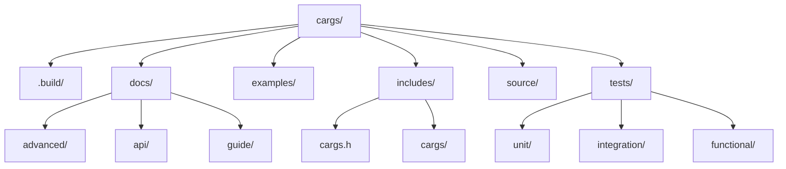

# Contribuer à cargs

!!! abstract "Aperçu"
    Merci pour votre intérêt à contribuer à cargs ! Ce guide explique comment configurer votre environnement de développement, soumettre des contributions et interagir avec la communauté. Nous accueillons les contributions de tous, quel que soit leur niveau d'expérience.

## Table des matières

- [Code de conduite](#code-de-conduite)
- [Démarrage](#demarrage)
- [Processus de contribution](#processus-de-contribution)
- [Directives de codage](#directives-de-codage)
- [Structure du projet](#structure-du-projet)
- [Tâches courantes](#taches-courantes)
- [Obtenir de l'aide](#obtenir-de-laide)

## Code de conduite

!!! note "Soyez respectueux"
    Veuillez être respectueux et attentionné envers les autres lorsque vous participez à ce projet. Nous attendons de chacun qu'il adhère à des normes professionnelles de communication et de collaboration. Le harcèlement, les commentaires offensants et autres comportements non professionnels ne seront pas tolérés.

## Démarrage

### Configuration de l'environnement de développement

!!! tip "Prérequis"
    Pour contribuer efficacement à cargs, vous aurez besoin des outils suivants installés :
    
    - Compilateur C (GCC ou Clang)
    - Système de construction Meson (≥ 1.0.0)
    - Outil de construction Ninja
    - Bibliothèque PCRE2 (pour la prise en charge des expressions régulières)
    - Criterion (pour les tests)
    - Just (pour des scripts pratiques) - recommandé
    - clang-format et clang-tidy (pour le formatage du code et l'analyse statique)

=== "Ubuntu/Debian"
    ```bash
    sudo apt-get update
    sudo apt-get install -y \
      gcc \
      meson \
      ninja-build \
      libpcre2-dev \
      libcriterion-dev \
      clang-format \
      clang-tidy
    
    # Installer Just (optionnel)
    # Voir https://github.com/casey/just#installation
    ```

=== "Fedora/CentOS"
    ```bash
    sudo dnf install -y \
      gcc \
      meson \
      ninja-build \
      pcre2-devel \
      criterion-devel \
      clang-tools-extra
    
    # Installer Just (optionnel)
    # Voir https://github.com/casey/just#installation
    ```

=== "macOS"
    ```bash
    brew install \
      gcc \
      meson \
      ninja \
      pcre2 \
      criterion \
      clang-format \
      just
    ```

### Processus GitHub pour les contributions open-source

!!! abstract "Le modèle Fork & Pull Request"
    Ce projet suit le workflow standard GitHub de fork et pull request. Si vous êtes nouveau dans ce processus, voici comment cela fonctionne :

=== "Étape 1 : Forker le dépôt"
    Naviguez vers le [dépôt original](https://github.com/lucocozz/cargs) et cliquez sur le bouton "Fork" dans le coin supérieur droit. Cela crée une copie du dépôt dans votre compte GitHub.
    
    

=== "Étape 2 : Cloner votre fork"
    ```bash
    # Cloner VOTRE fork sur votre machine locale (remplacez VOTRE_NOM_UTILISATEUR par votre nom d'utilisateur GitHub)
    git clone https://github.com/VOTRE_NOM_UTILISATEUR/cargs.git
    cd cargs
    
    # Ajouter le dépôt original comme remote appelé "upstream"
    git remote add upstream https://github.com/lucocozz/cargs.git
    ```

=== "Étape 3 : Maintenir votre fork à jour"
    ```bash
    # Récupérer les changements du dépôt original
    git fetch upstream
    
    # Fusionner les changements de upstream/develop dans votre branche develop locale
    git checkout develop
    git merge upstream/develop
    
    # Pousser les mises à jour vers votre fork
    git push origin develop
    ```

### Construire le projet

Après avoir cloné votre fork, vous pouvez construire le projet :

=== "Utiliser Meson"
    ```bash
    # Construire
    meson setup .build
    meson compile -C .build
    ```

=== "Utiliser Just (recommandé)"
    ```bash
    # Construire les bibliothèques statiques et partagées
    just build
    ```

### Exécuter les tests

!!! warning "Important"
    Exécutez toujours les tests avant de soumettre une pull request pour vous assurer que vos modifications ne cassent pas les fonctionnalités existantes.

```bash
# Exécuter tous les tests
just test

# Exécuter uniquement les tests unitaires
just test-unit

# Exécuter uniquement les tests d'intégration
just test-integration

# Exécuter uniquement les tests fonctionnels
just test-functional

# Exécuter un test spécifique
just test-one unit_strings
```

## Processus de contribution

!!! abstract "Aperçu du processus"
    Nous utilisons l'approche "Issue First" pour gérer les contributions :
    
    1. **Créer d'abord une Issue** : Avant de soumettre une Pull Request, créez une issue pour discuter du changement que vous souhaitez apporter
    2. **Attendre les retours** : Permettez à la communauté et aux mainteneurs de fournir des commentaires
    3. **Implémenter les changements** : Une fois qu'il y a un accord sur la façon de procéder
    4. **Soumettre une Pull Request** : Référencer l'issue dans votre PR

### Créer des Issues

Avant d'écrire du code, créez une issue pour discuter de vos changements proposés :

- Pour les bugs, créez un **Bug Report** en utilisant le modèle
- Pour les nouvelles fonctionnalités, créez une **Feature Request** en utilisant le modèle
- Pour les questions, utilisez le modèle **Question** ou GitHub Discussions

Fournissez autant de détails que possible pour aider les mainteneurs à comprendre votre proposition ou le bug que vous avez rencontré.

### Apporter des modifications

Après avoir configuré votre fork, suivez ces étapes pour apporter des modifications au code :

1. **Assurez-vous que votre fork est à jour** avec le dépôt original :

    ```bash
    git fetch upstream
    git checkout develop
    git merge upstream/develop
    ```

2. **Créez une branche** avec un nom descriptif :

    ```bash
    git checkout -b feature/ma-nouvelle-fonctionnalite  # ou bugfix/description-du-probleme
    ```

    !!! tip "Conventions de nommage des branches"
        - `feature/` - pour les nouvelles fonctionnalités
        - `bugfix/` - pour les corrections de bugs
        - `docs/` - pour les modifications de documentation
        - `refactor/` - pour la refactorisation du code
        - `test/` - pour ajouter ou mettre à jour des tests

3. **Faites des changements ciblés** qui ne traitent que le problème en question

4. **Ajoutez des tests** pour vos modifications, surtout pour les corrections de bugs et les nouvelles fonctionnalités

5. **Assurez-vous de la qualité du code** avec le formatage et la vérification :

    ```bash
    # Formater votre code
    just format
    
    # Exécuter l'analyse statique
    just lint
    ```

6. **Committez vos changements** avec des messages de commit clairs et descriptifs :

    ```bash
    git add .
    git commit -m "feat: ajouter le support pour xyz"  # ou "fix: résoudre le problème avec abc"
    ```

    Suivez le format [Conventional Commits](https://www.conventionalcommits.org/) lorsque c'est possible :
    
    | Type | Description |
    |------|-------------|
    | `feat` | Nouvelle fonctionnalité |
    | `fix` | Correction de bug |
    | `docs` | Changement de documentation |
    | `style` | Formatage, etc. ; pas de changement de code |
    | `refactor` | Refactorisation de code |
    | `test` | Ajout ou mise à jour de tests |
    | `chore` | Mise à jour de tâches de build, etc. ; pas de changement de code |

### Soumettre des Pull Requests

=== "Étape 1 : Pousser les changements"
    ```bash
    # Pousser votre branche vers votre fork
    git push origin feature/ma-nouvelle-fonctionnalite
    ```

=== "Étape 2 : Créer la PR"
    Allez sur le [dépôt original](https://github.com/lucocozz/cargs) sur GitHub. Vous devriez voir un bouton "Compare & pull request" pour votre branche récemment poussée.
    
    
    
    Cliquez sur ce bouton et remplissez complètement le modèle de PR.

=== "Étape 3 : Référencer l'Issue"
    Assurez-vous de référencer l'issue originale dans la description de votre PR en utilisant la syntaxe "Fixes #123" ou "Closes #123". Cela lie automatiquement la PR à l'issue et fermera l'issue lorsque la PR sera fusionnée.
    
    Exemple : `Cette PR corrige #42 en implémentant la nouvelle fonctionnalité.`

!!! tip "Directives pour les PR"
    1. **Une PR par issue** : Gardez vos changements concentrés sur le traitement d'une seule issue
    2. **Suivez le style de codage** : Assurez-vous que votre code est formaté selon les standards du projet
    3. **Écrivez des tests** : Ajoutez des tests pour couvrir vos changements
    4. **Mettez à jour la documentation** : Gardez la documentation en phase avec vos changements
    5. **Gardez les PR petites** : Les PR plus petites et ciblées sont plus faciles à examiner et plus susceptibles d'être acceptées

## Directives de codage

### Style de code

cargs suit un style de codage cohérent appliqué par clang-format :

| Règle | Valeur |
|------|-------|
| Indentation | 4 espaces (pas de tabulations) |
| Longueur de ligne | 100 caractères maximum |
| Accolades de fonction | Sur nouvelle ligne |
| Opérateurs | Espacés (ex., `a + b`) |
| Nommage | Descriptif, minuscules avec underscores |

!!! note "Formatage automatique"
    Le style est défini dans le fichier `.clang-format`. Exécutez toujours `just format` avant de committer des changements pour vous assurer que votre code suit le style du projet.

### Documentation

Une bonne documentation est cruciale pour maintenir le code :

- Documentez toutes les fonctions, types et macros publics
- Écrivez des commentaires clairs pour la logique complexe
- Mettez à jour la documentation lors de la modification de fonctionnalités
- Utilisez markdown pour les fichiers de documentation

```c
/**
 * Analyse les arguments de ligne de commande selon les options définies.
 *
 * @param cargs Pointeur vers un contexte cargs initialisé
 * @param argc  Nombre d'arguments (de main)
 * @param argv  Valeurs des arguments (de main)
 * @return CARGS_SUCCESS en cas de succès, code d'erreur sinon
 */
int cargs_parse(cargs_t *cargs, int argc, char **argv);
```

### Tests

!!! warning "Tests requis"
    Toutes les nouvelles fonctionnalités et corrections de bugs doivent inclure des tests pour vérifier leur exactitude.

- Écrivez des tests pour toutes les nouvelles fonctionnalités
- Mettez à jour les tests lors de la modification de fonctionnalités existantes
- Assurez-vous que tous les tests passent avant de soumettre une PR
- Visez une couverture de test élevée (particulièrement pour les fonctionnalités de base)

## Structure du projet

Comprendre la structure du projet vous aidera à apporter des contributions plus efficaces :



| Répertoire | Description |
|-----------|-------------|
| `.build/` | Répertoire de construction (créé par Meson) |
| `docs/` | Fichiers de documentation |
| `examples/` | Programmes d'exemple |
| `includes/` | Fichiers d'en-tête publics |
| `source/` | Implémentation du code source |
| `tests/` | Suites de tests |

## Tâches courantes

Le Justfile fournit des raccourcis pour les tâches de développement courantes :

=== "Construction"
    ```bash
    # Construire le projet
    just build
    
    # Nettoyer les artefacts de construction
    just clean
    
    # Nettoyage complet (supprimer le répertoire de construction)
    just fclean
    
    # Reconstruire depuis zéro
    just re
    ```

=== "Qualité du code"
    ```bash
    # Formater le code
    just format
    
    # Analyse statique
    just lint
    
    # Appliquer des corrections automatisées
    just fix
    ```

=== "Tests"
    ```bash
    # Exécuter tous les tests
    just test
    
    # Exécuter une suite de tests spécifique
    just test-unit
    just test-integration
    just test-functional
    
    # Exécuter un test spécifique
    just test-one unit_strings
    
    # Générer un rapport de couverture de test
    just test-coverage
    ```

=== "Installation"
    ```bash
    # Installer la bibliothèque
    just install
    
    # Désinstaller la bibliothèque
    just uninstall
    ```

!!! tip "Lister les commandes disponibles"
    ```bash
    # Afficher toutes les commandes disponibles
    just help
    ```

## Obtenir de l'aide

Si vous avez des questions ou besoin d'aide pour contribuer :

- Ouvrez une discussion sur GitHub Discussions
- Posez des questions dans l'issue concernée
- Contactez directement les mainteneurs

Merci de contribuer à cargs ! 🎉
