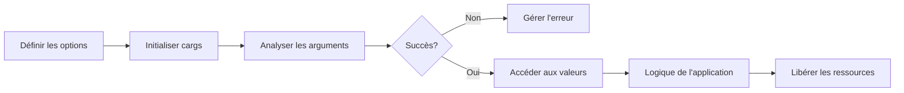

# Démarrage rapide

Ce guide vous aidera à créer rapidement une application simple utilisant cargs pour traiter les arguments de ligne de commande.

## Exemple minimal

Voici un exemple minimal d'utilisation de cargs :

```c
#include "cargs.h"
#include <stdio.h>

// Définir les options
CARGS_OPTIONS(
    options,
    HELP_OPTION(FLAGS(FLAG_EXIT)),
    VERSION_OPTION(FLAGS(FLAG_EXIT)),
    OPTION_FLAG('v', "verbose", "Activer le mode verbeux")
)

int main(int argc, char **argv)
{
    // Initialiser cargs
    cargs_t cargs = cargs_init(options, "my_program", "1.0.0");
    
    // Analyser les arguments
    int status = cargs_parse(&cargs, argc, argv);
    if (status != CARGS_SUCCESS) {
        return status;
    }
    
    // Accéder aux valeurs analysées
    bool verbose = cargs_get(cargs, "verbose").as_bool;
    
    // Logique de l'application
    if (verbose) {
        printf("Mode verbeux activé\n");
    }
    
    // Libérer les ressources
    cargs_free(&cargs);
    return 0;
}
```

## Étapes fondamentales

!!! abstract "Processus"
    Voici les étapes essentielles pour utiliser cargs dans votre application :

    1. **Inclure l'en-tête** : Commencez par inclure l'en-tête `cargs.h`.
    2. **Définir les options** : Utilisez la macro `CARGS_OPTIONS` pour définir les options acceptées par votre programme.
    3. **Initialiser cargs** : Appelez `cargs_init()` pour initialiser le contexte cargs.
    4. **Analyser les arguments** : Utilisez `cargs_parse()` pour analyser les arguments de ligne de commande.
    5. **Accéder aux valeurs** : Utilisez `cargs_get()`, `cargs_is_set()` et d'autres fonctions pour accéder aux valeurs des options.
    6. **Libérer les ressources** : Appelez `cargs_free()` avant de quitter pour libérer les ressources allouées.

## Types d'options

Cargs prend en charge plusieurs types d'options que vous pouvez utiliser dans votre application :

| Type | Macro | Description | Exemple |
|------|-------|-------------|---------|
| **Flag** | `OPTION_FLAG` | Option booléenne (présence/absence) | `OPTION_FLAG('v', "verbose", "Mode verbeux")` |
| **String** | `OPTION_STRING` | Option avec valeur de chaîne | `OPTION_STRING('o', "output", "Fichier de sortie")` |
| **Integer** | `OPTION_INT` | Option avec valeur entière | `OPTION_INT('p', "port", "Numéro de port")` |
| **Float** | `OPTION_FLOAT` | Option avec valeur à virgule flottante | `OPTION_FLOAT('f', "factor", "Facteur d'échelle")` |
| **Positional** | `POSITIONAL_*` | Argument positionnel | `POSITIONAL_STRING("input", "Fichier d'entrée")` |
| **Subcommand** | `SUBCOMMAND` | Sous-commande avec ses propres options | `SUBCOMMAND("add", add_options, ...)` |

## Exemple complet

Voici un exemple plus complet incluant différents types d'options :

=== "Définition des options"
    ```c
    CARGS_OPTIONS(
        options,
        HELP_OPTION(FLAGS(FLAG_EXIT)),
        VERSION_OPTION(FLAGS(FLAG_EXIT)),
        OPTION_FLAG('v', "verbose", "Activer le mode verbeux"),
        OPTION_STRING('o', "output", "Fichier de sortie", DEFAULT("output.txt")),
        OPTION_INT('c', "count", "Nombre d'itérations", RANGE(1, 100), DEFAULT(10)),
        OPTION_FLOAT('f', "factor", "Facteur d'échelle", DEFAULT(1.0)),
        POSITIONAL_STRING("input", "Fichier d'entrée")
    )
    ```

=== "Code principal"
    ```c
    #include "cargs.h"
    #include <stdio.h>
    #include <stdlib.h>

    // Définition des options (voir l'onglet précédent)

    int main(int argc, char **argv)
    {
        // Initialiser cargs
        cargs_t cargs = cargs_init(options, "complete_example", "1.0.0");
        cargs.description = "Exemple complet de cargs";
        
        // Analyser les arguments
        int status = cargs_parse(&cargs, argc, argv);
        if (status != CARGS_SUCCESS) {
            return status;
        }
        
        // Accéder aux valeurs analysées
        const char *input = cargs_get(cargs, "input").as_string;
        const char *output = cargs_get(cargs, "output").as_string;
        int count = cargs_get(cargs, "count").as_int;
        double factor = cargs_get(cargs, "factor").as_float;
        bool verbose = cargs_get(cargs, "verbose").as_bool;
        
        // Afficher la configuration
        printf("Configuration :\n");
        printf("  Entrée : %s\n", input);
        printf("  Sortie : %s\n", output);
        printf("  Compteur : %d\n", count);
        printf("  Facteur : %.2f\n", factor);
        printf("  Verbeux : %s\n", verbose ? "oui" : "non");
        
        // Libérer les ressources
        cargs_free(&cargs);
        return 0;
    }
    ```

=== "Compilation"
    ```bash
    gcc -o complete_example complete_example.c -lcargs -lpcre2-8
    ```

## Aide générée automatiquement

Avec les options `HELP_OPTION` et `VERSION_OPTION`, cargs génère automatiquement des informations d'aide et de version formatées lorsque l'utilisateur spécifie `--help` ou `--version`.

!!! example "Exemple d'aide générée"
    ```
    complete_example v1.0.0

    Exemple complet de cargs

    Usage: complete_example [OPTIONS] <input>

    Arguments:
      <input>                - Fichier d'entrée

    Options:
      -h, --help             - Afficher ce message d'aide (exit)
      -V, --version          - Afficher les informations de version (exit)
      -v, --verbose          - Activer le mode verbeux
      -o, --output <STR>     - Fichier de sortie (défaut : "output.txt")
      -c, --count <NUM>      - Nombre d'itérations [1-100] (défaut : 10)
      -f, --factor <FLOAT>   - Facteur d'échelle (défaut : 1.00)
    ```

## Flux de développement typique

Le développement d'une application avec cargs suit généralement ce processus :



## Prochaines étapes

Maintenant que vous avez créé une application de base avec cargs, vous pouvez explorer des fonctionnalités plus avancées :

- [Options de base](basic-options.md) - En savoir plus sur les différents types d'options
- [Sous-commandes](subcommands.md) - Créer des applications avec des sous-commandes comme Git ou Docker
- [Validation](validation.md) - Valider les entrées utilisateur avec des validateurs intégrés ou personnalisés
